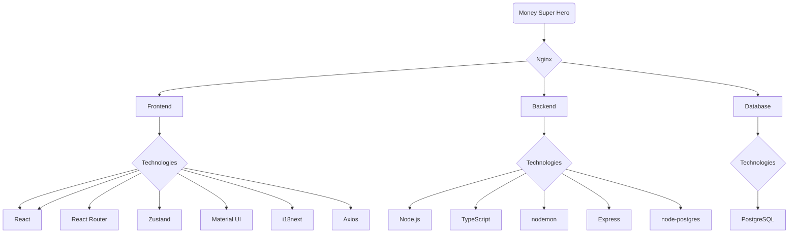

# Money Super Hero

Application for managing your budget

## Version
Work in Progress :construction_worker:

## Prerequisites
- Node.js
- Docker

## Project Structure


## First run

```bash
  docker compose up --build
```

## Run

```bash
  docker compose up
```

## Development

### App url
`http://localhost:8000/`

## Authors

| Riccardo Giovarelli | [](https://linkedin.com/in/riccardo-giovarelli) [](https://github.com/riccardo-giovarelli)  |
|---|---|

## License

[MIT](https://opensource.org/license/mit)


## Badges

[](https://choosealicense.com/licenses/mit/)
[](https://www.docker.com/)
[](https://www.postgresql.org/)
[](https://yarnpkg.com/)
[](https://www.typescriptlang.org/)
[](https://nodejs.org/)
[](https://expressjs.com/)
[](https://nodemon.io/)
[](https://vite.dev/)
[](https://react.dev/)
[](https://reactrouter.com/)
[](https://zustand.docs.pmnd.rs/)
[](https://www.i18next.com/)
[](https://axios-http.com/)


